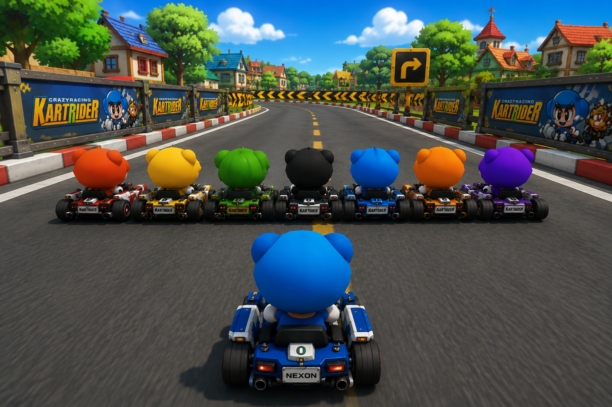

요즘 앞에서 여러 사람이 일렬 횡대로 천천히 걸어가는 경우가 많습니다..

저는 걸음이 빠른 편인데... 그러면 추월도 못하고, 비켜달라고도 말도 잘 못합니다.. 

  

오늘도 그런 일이 있었는데요...

HTTP의 발전 과정과 HTTP/2가 비슷한 문제를 어떻게 개선했는지 정리해보겠습니다...

<!--more-->

---

앞의 느린 요청 때문에 뒤의 모든 요청이 함께 대기하는 현상.

>바로 **Head-of-Line Blocking(HOL Blocking)** 입니다.

## 1. HTTP/1.1의 문제: HOL Blocking

HTTP/1.1은 한 번에 하나의 요청만 처리할 수 있는 구조이기 때문에 앞선 요청이 완료되어야만 다음 요청을 보낼 수 있었습니다.

- 문제 상황: 좁은 길에서 세 명이 꽉 끼어 천천히 걸어가는 것과 같습니다. 뒤에 있는 사람이 아무리 발이 빨라도, 앞사람만 보면서 속도를 맞춰야 합니다.

- 기술적 정의: TCP 연결 상에서 가장 첫 번째 패킷(Head-of-Line)이 지연되거나 손실되면 나머지 패킷들은 처리가 완료되어도 앞선 패킷이 처리될 때까지 대기해야 하는 병목 현상입니다.

## 2. HTTP/2의 멀티플렉싱(Multiplexing)

HTTP/2에서는 `길을 넓히는 대신, 데이터를 잘게 쪼개는 방식` 으로 이런 문제를 해결했습니다.

- 바이너리 프레이밍(Binary Framing): 데이터를 전송할 때 큰 덩어리가 아니라 `프레임` 이라는 작은 단위로 쪼개어 보냅니다.

- 멀티플렉싱: 하나의 연결 안에서 여러 개의 스트림(Stream)을 열어 조각난 프레임들을 섞어서 보냅니다. 앞선 프레임이 느려도 뒤에 있는 프레임들이 그 사이 빈틈으로 먼저 도착할 수 있습니다.

## 이렇게 걸읍ㅅ시다

1. 프레임 간격 유지 (Interleaving)

    일렬 횡대로 걷더라도 사람과 사람 사이에 최소한 한 명이 지나갈 수 있는 간격을 둡니다. 
    - HTTP/2가 데이터를 조각내어 사이사이에 끼워 넣는 것과 같습니다. 
    - 뒤에서 빠른 보행자가 오면 그 틈새로 자연스럽게 `멀티플렉싱` 되어 지나갈 수 있습니다.

2. 우선순위(Priority)에 따른 차선 배정

    HTTP/2는 중요한 리소스에 우선순위를 부여합니다. 길에서도 속도가 느린 무리는 Low Priority로 간주하여 길의 가장자리로 붙어 걷습니다. 
    - 길의 중앙(High Priority)을 비워두는 것만으로도 전체 네트워크(길)의 지연 시간(Latency)을   줄일 수 있습니다..

3. 동적 스트림 조절

    만약 뒤에서 빠른 사람이 오고 있다면... 일시적으로 횡대 대열을 깨고 종대(Serial)로 대형을 변경합니다. 
    - 트래픽 상황에 따라 스트림의 가중치를 조절하여 병목을 선제적으로 방지하는 Congestion Control과 유사한 배려입니다...

